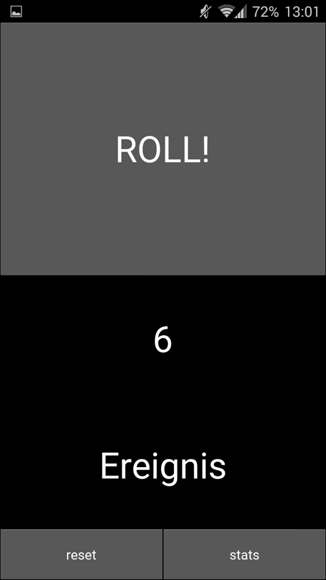
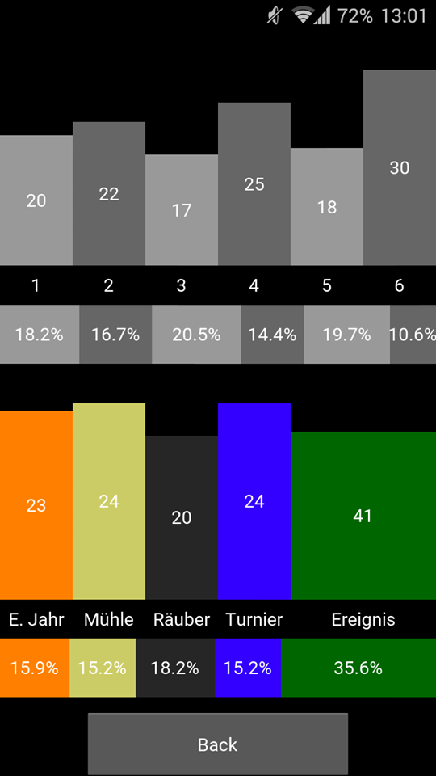

A cross-platform smartphone app to simulate dice rolls for the Settlers of Catan Card Game for two players
=========

A small toy app I made to learn [Kivy](https://kivy.org/).

The point of this app is to make dice rolls a little less erratic and remove some of the randomness of the Settlers Card Game. To achieve this, the probability to roll each side is adjusted based on past events. Frequently-rolled numbers get a decreased chance to be rolled again, while seldomly rolled numbers get a boosted chance. The app also tracks all dice rolls to display stats histograms at the end of the game.

Screenshots
=========

Main menu and stats screen. The stats screen shows how often every side was rolled (histograms) and the probability to roll each side in the next turn (horizontal bars).

